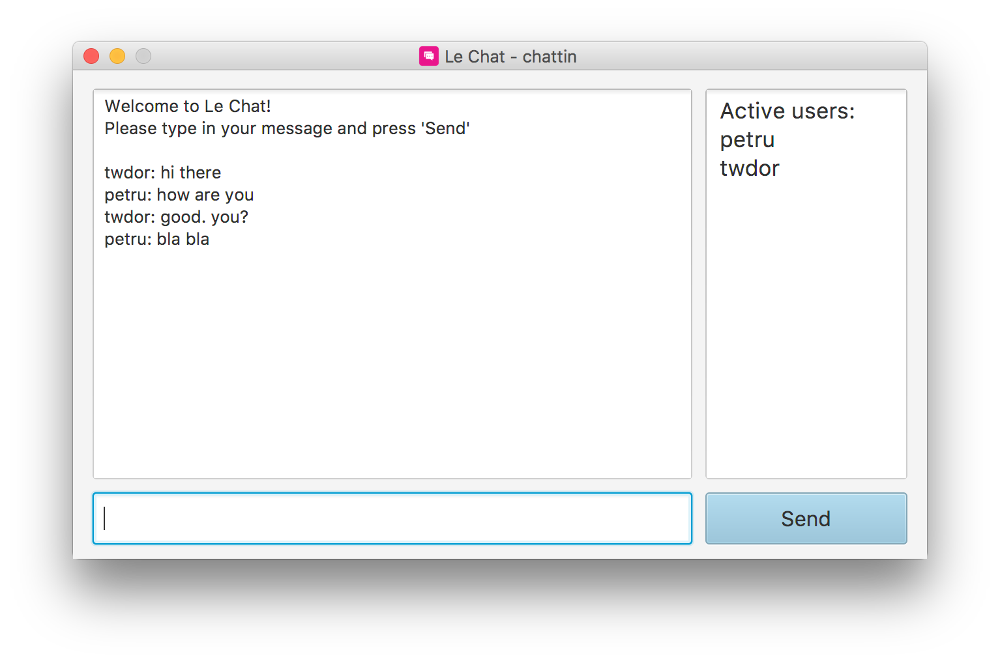
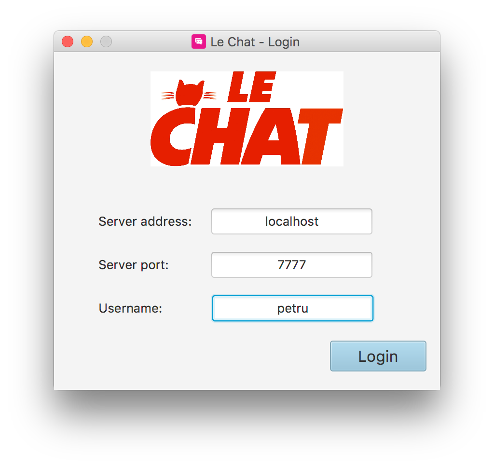

# Le Chat

> Desktop chat application built with **JavaFX**

# Features

* Message communication with all the connected users

* Friendly user interface with **JavaFX**

  

# Technologies

* [Java](https://go.java/) - widely used object-oriented language, the core of the system

* [JavaFX](http://docs.oracle.com/javafx/2/overview/jfxpub-overview.htm) - Java user interface library

# Motivation

This is a school project with the purpose of implementing a data transfer protocol (**TCP** or **UDP**) in a messaging application.
